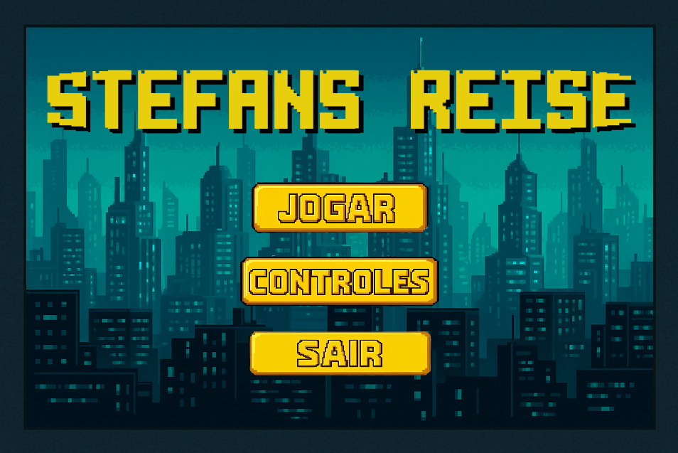
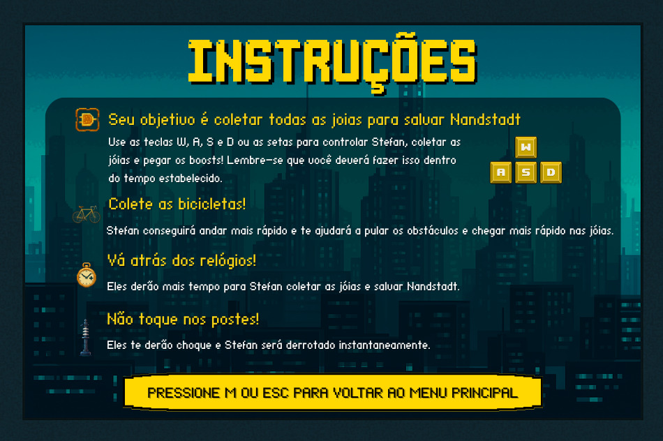
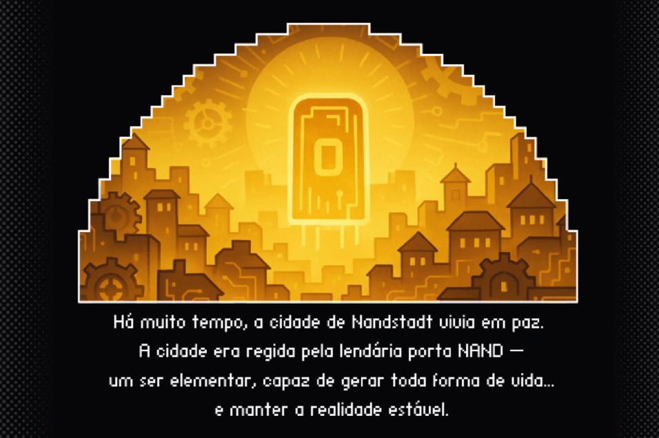
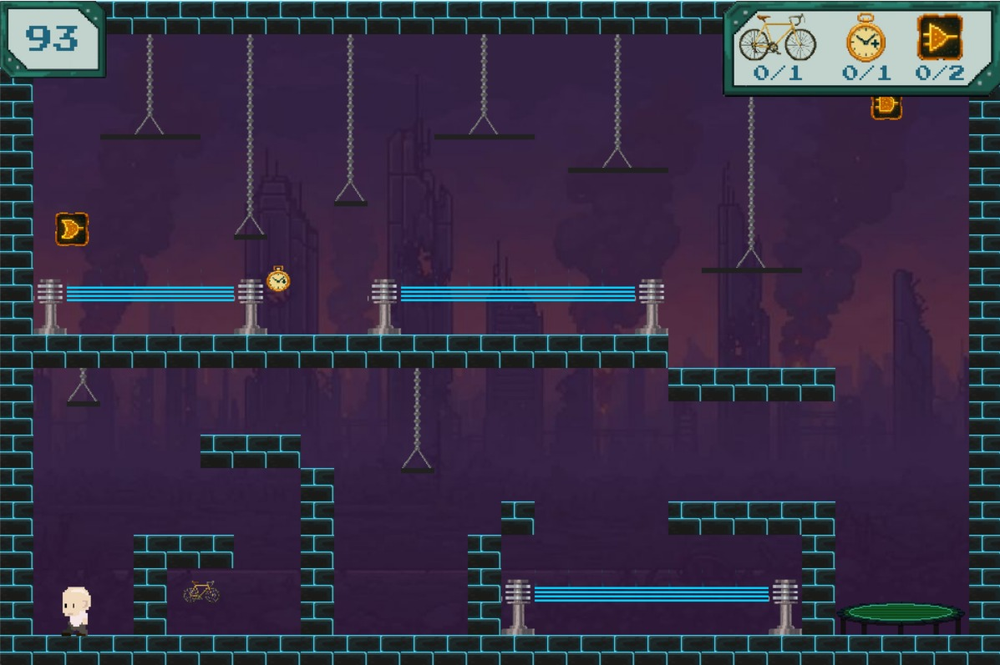
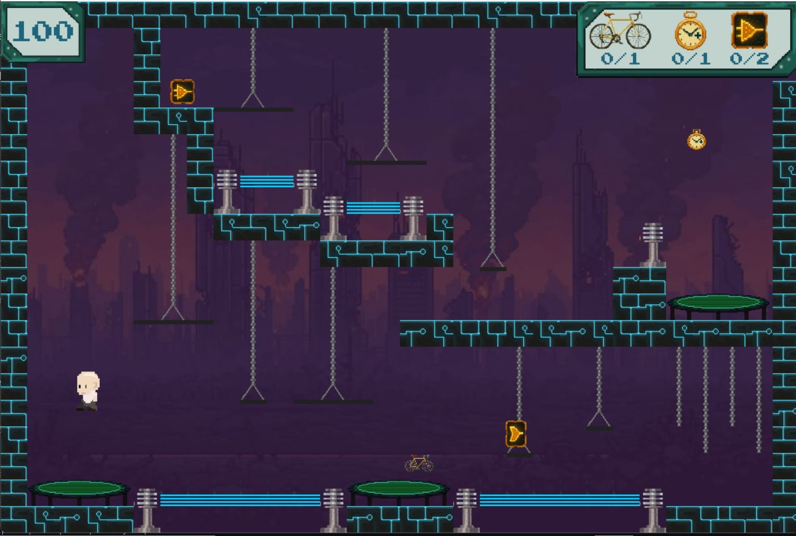
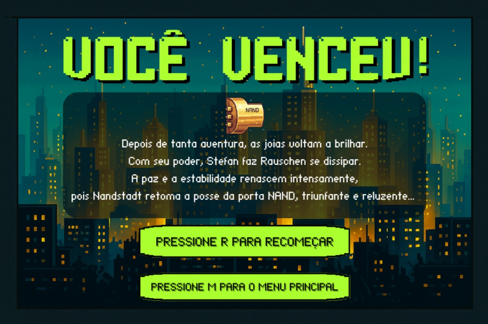
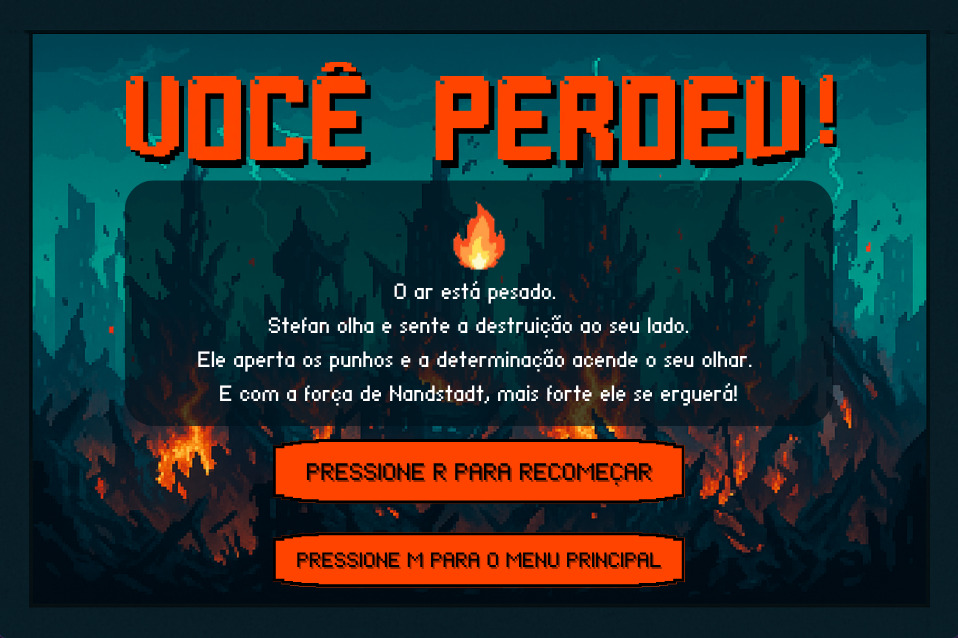

# 🎮 | Stefans Reise (A Jornada de Stefan)

Na outrora pacífica cidade de **Nandstadt**, uma força caótica chamada **Rauschen** emergiu da instabilidade dos circuitos, estilhaçando a ordem e decompondo a poderosa **Porta NAND** — a entidade que regia toda a realidade — em quatro joias de poder: **AND**, **OR**, **NOT** e **XOR**.  

Agora, o mundo digital é um caos de chips queimados e comunicação interrompida.  
Assuma o controle do professor **Stefan Blawid**, o único herói com conhecimento para reverter o desastre. Montado em sua bicicleta de precisão, navegue pelos circuitos em ruínas em uma missão para encontrar as quatro joias lógicas.  

Apenas reunindo-as e restaurando o poder universal da **NAND** você poderá expurgar o ruído e salvar a cidade da desordem total.


## 👨‍💻 | Integrantes

- Luís Eduardo Cavalcante Santos [&lt;lecs2&gt;](lecs2@cin.ufpe.br) ([@luiseduaardo](https://github.com/luiseduaardo))
- João Vitor Figueiredo de Vasconcelos [&lt;jvfv&gt;](jvfv@cin.ufpe.br) ([@jvitorfig](https://github.com/jvitorfig))
- João Victor Siqueira Araújo [&lt;jvsa&gt;](jvsa@cin.ufpe.br) ([@jvictorsiqueira14](https://github.com/jvictorsiqueira14))
- Nara Maria Silva Pontes [&lt;nmsp&gt;](nmsa@cin.ufpe.br) ([@naramsp](https://github.com/naramsp))
- Eduardo Henrique Buarque Almeida [&lt;ehba&gt;](ehba@cin.ufpe.br) ([@ed-henri](https://github.com/ed-henri))


## 🧾 | Arquitetura do projeto e organização

O projeto foi organizado para garantir uma separação entre o código-fonte, os recursos visuais e os recursos de áudio, organizando em módulos distintos e nos ajudando na organização do código por meio de Classes e da Programação Orientada a Objetos (POO).

```
.
├── 📂 imagens/         # Recursos visuais
├── 📂 sons/         # Músicas e SFX
├── 📂 src/            # Código-fonte do jogo
|   ├── 📜 botoes.py       # Lógica dos botões
|   ├── 📜 coletaveis.py   # Lógica dos itens coletáveis
|   ├── 📜 constants.py    # Constantes (tamanho da tela, cores, FPS)
|   ├── 📜 game.py         # Gerenciamento do jogo
|   ├── 📜 main.py         # Execução do jogo
|   ├── 📜 mapa.py         # Carregamento dos mapas
|   ├── 📜 stefan.py       # Lógica do personagem principal
|   └── 📜 telas.py        # Lógica das telas (menu, gameplay)
└── 📜 README.md        # Relatório e documentação geral do projeto
```


## 📸 | Capturas de tela

*Tela de início*


*Tela de instruções*


*Tela de contextualização da história do jogo*


*Primeira fase*


*Segunda fase*


*Tela de vitória*


*Tela de derrota*


## ⚙️ | Ferramentas utilizadas e justificativas
🐍 **Python**
Linguagem de programação usada no projeto, sendo escolhida por ter sido a que trabalhamos no decorrer do semestre, além de ter sido exigência para o desenvolvimento desse projeto.

🎮 **Pygame**
Utilizamos como base essa biblioteca externa por ser a principal no desenvolvimento de jogos 2D devido a suas funcionalidades essenciais, dentre elas a renderização de gráficos 2D, gerenciamento de sprites, detecção de colisões, manipulação de eventos de teclado e mouse, e o controle de áudio (música e efeitos sonoros).

📹 **MoviePy & NumPy**
Bibliotecas externas que foram usadas para a tela de slideshow, que foi exportada como um vídeo. O NumPy, enquanto uma lib para gerenciar dados numéricos, foi usada de maneira integrada com o MoviePy para manipular os dados de vídeo e criar os efeitos que precisávamos.

📋 **Trello**
Usamos para organizar as tarefas e gerenciar os prazos, atribuindo mais facilmente cada tarefa para uma pessoa e possibilitando ver quais tarefas são pendentes, foram feitas antes do prazo ou estão quase estourando as deadlines.

🌐 **Git & GitHub**
Ferramentas mais conhecidas e utilizadas para versionamento de código. Escolhemos pela grande diversidade de informações disponíveis sobre o assunto na internet. Usamos como fluxo de trabalho o GitFlow, o que funcionou muito bem.

🗺️ **Tiled**
Escolhemos o Tiled, uma vez que por meio dele, pudemos criar visualmente as fases do jogo, utilizando camadas para plataformas, itens e decoração. A capacidade de exportar os mapas em formatos de dados legíveis permitiu que nosso código carregasse e construísse as fases dinamicamente.

🎨 **Pixelorama**
Editor de pixel art gratuito e open-source, escolhido por ser uma ferramenta que tinhamos a opção de criamos tanto os sprites estáticos do jogo (plataformas, coletáveis) quanto as animações do personagem principal. A principal vantagem que nos fez escolhe-lo foi a capacidade de exportar sequências de animação diretamente para um único arquivo de spritesheet, o que simplificou a implementação no código.

🎨 **Canva**
Ferramenta utilizada para a criação de toda a identidade visual da GUI do jogo. Os botões, títulos e a disposição geral dos textos foram todos concebidos na plataforma antes de serem exportados como assets individuais para a implementação no Pygame.

🔊 **jsfxr**
Foi escolhido pela facilidade na produção de diferentes tipos de efeitos sonoros com uma customização dinâmica e simples, economizando tempo comparado com outras ferramentas de produção de efeitos sonoros.

🎵 **YouTube** & **Wav.ninja**
Possuem uma extensa quantidade de opções facilmente acessíveis para a trilha sonora do projeto, permitindo maior gama de opções e possibilidade de buscar por temas específicos.


## 🕹️ | Como Executar
1. Certifique-se de ter o **Python 3.8+** ou superior instalado na sua máquina.
2. Instale o **Pygame** (necessário para rodar o jogo):
   ```bash
   pip install pygame
   ```
3. Baixe ou clone o repositório:
   ```bash
   git clone https://github.com/luiseduaardo/Projeto-Final-IP.git
   ```
4. Navegue até a pasta do projeto:
   ```bash
   cd Projeto-Final-IP
   ```
5. Execute o arquivo principal que está dentro de `src/`:
   ```bash
   python src/main.py
   ```
6. Divirta-se! 🎮


## 👥 | Divisão de tarefas

**Luís Eduardo [&lt;lecs2&gt;](lecs2@cin.ufpe.br):**
- Movimentação e física do jogador  
- Mecânica dos coletáveis  
- Colisão do jogador  
- Modularização do código  

**João Vitor Figueiredo [&lt;jvfv&gt;](jvfv@cin.ufpe.br):**
- Criação e integração das telas  
- Artes e implementação da HUD  
- Apoio na modularização do código 

**Nara Pontes [&lt;nmsp&gt;](nmsa@cin.ufpe.br):**
- Produção de sprites  
- Playtesting e debugging  
- Implementação de mapas e colisões  

**Victor Siqueira [&lt;jvsa&gt;](jvsa@cin.ufpe.br):**
- Artes (UI e outros elementos)  
- Level design  

**Eduardo Henrique [&lt;ehba&gt;](ehba@cin.ufpe.br):**
- Efeitos sonoros e trilha sonora  
- Documentação do projeto  

Além disso, todos os integrantes fizeram conjuntamente a concepção da história do jogo.


## 📚 | Conceitos utilizados
Dentre os conceitos que pudemos aprender no decorrer da disciplina e em nossos estudos pessoais para o desenvolvimento desse projeto, se destacam os sequintes:

**- Estruturas de controle e estruturas de dados:** condicionais, laços de repetição, listas, funções, tuplas, etc. Esses conceitos foram a base dos nossos aprendizados durante o semestre, nos proporcionando autonomia para aprender novos conceitos mais facilmente e nos dando a base de toda a lógica de programação, sendo assim fundamentais para o nosso projeto.

**- Programação Orientada a Objetos (POO) e modularização:** ao invés de usar funções soltas, o nosso código foi totalmente estruturado em Classes que representam os objetos do mundo do jogo, cada um com seus próprios atributos e métodos. 
A partir disso, pudemos dividir todo o nosso programa em múltiplos arquivos menores e mais gerenciáveis, cada um com uma responsabilidade bem definida e já explicada anteriormente na parte de arquitetura do projeto.

**- Versionamento de código:** os conceitos que aprendemos relacionados ao versionamento de código com Git e GitHub foram imprescindíveis para que nós pudessemos seguir de maneira ordenada e com certeza nos serão úteis a partir de então nos nossos projetos pessoais e em grupo.


## 🧠 | Desafios e lições aprendidas
**Qual foi o maior erro cometido durante o projeto? Como vocês lidaram com ele?**
Percebemos no desenvolvimento do nosso projeto dois erros que geraram aprendizados valiosos, um técnico e um de design.

O maior erro técnico foi a gestão de um merge complexo para a branch develop. Isso ocorreu após um período de desenvolvimento paralelo, onde três membros da equipe trabalharam em feature branches distintas por um tempo prolongado. Como resultado, as bases de código divergiram bastante, gerando múltiplos conflitos que foram muito difíceis de resolver. Para lidar com a situação, a equipe teve de resolver os conflitos na força bruta, revisando e reescrevendo partes do código linha a linha para garantir que as três funcionalidades fossem unificadas sem introduzir novos bugs. A lição foi a importância de realizar merges menores e mais frequentes para evitar grandes divergências.

O segundo erro foi de design de níveis. Inicialmente, projetamos mapas mais complexos de execução e pouco integrados com os coletáveis. No entanto, durante os testes, percebemos que a física que havíamos programado para o personagem, principalmente a questão de pulos, não era compatível com a dificuldade dos mapas. Como a física já estava bastante ajustada e precisa, tomamos a decisão de redesenhar os mapas. Simplificamos várias partes e ajustamos os desafios para que continuassem divertidos e pudessem ser executados de fato, mantendo um nível de dificuldade razoável. Com isso, percebemos a importância de testar a jogabilidade de forma integrada com o design de níveis desde o início.

**Qual foi o maior desafio enfrentado durante o projeto? Como vocês lidaram com ele?**
Nosso maior desafio foi conseguir equilibrar nossas ideias com o tempo que tivemos. No começo, a gente se empolgou e pensou em várias mecânicas mais complexas, como plataformas móveis, um nível para cada jóia, etc. Entretanto, muitas dessas ideias, apesar de legais, eram inviáveis para o nosso prazo. Sempre chegávamos no entrave entre ter que escolher entre o que queríamos fazer e o que realmente dava pra fazer bem feito.

Para lidar com isso, a gente conversava muito e priorizava o tempo todo. Para cada ideia, a gente discutia o que realmente era essencial pro jogo funcionar. Isso nos forçou a cortar algumas coisas e a simplificar outras, mas sempre com o cuidado de cumprir os requisitos principais do projeto. Essa comunicação constante foi essencial para manter o foco e entregar um jogo completo e legal de jogar.

**Quais as lições aprendidas durante o projeto?**
- É essencial integrar e testar tudo junto: pudemos perceber as partes do jogo, assim como de qualquer projeto que formos fazer daqui para a frente, não vivem isoladas. O nosso primeiro design de mapas, por exemplo, não funcionava com a física do personagem que tínhamos programado. Não adianta termos uma parte legal se ela não "conversa" com as outras.

- Saber descartar ideias é tão importante quanto ter: com esse projeto, pudemos aprender na prática a priorizar o que era essencial para a experiência do jogo e a simplificar ou cortar o resto. Essa habilidade de gerenciar o escopo foi o que nos permitiu, no fim das contas, entregar um jogo completo e funcional.

